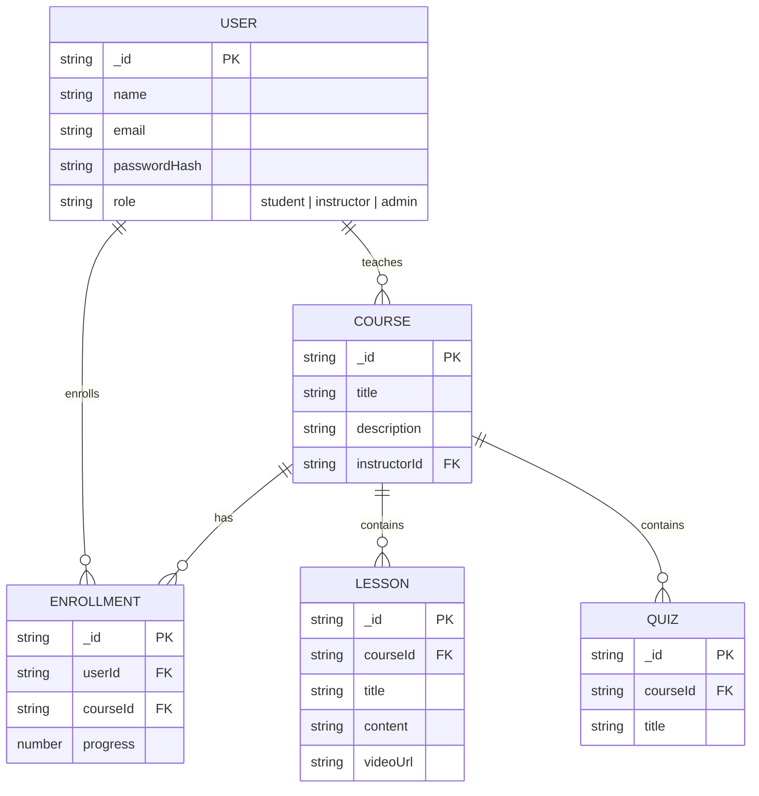

# 📘 OOAD (LMS) — Full‑Stack E‑Learning Boilerplate

A concise, production‑ready starter for a modern e‑learning platform.

Core stack
- Frontend: Vue 3 + Vite + Tailwind CSS + Pinia + Vue Router
- Backend: Node.js + Express + MongoDB + JWT authentication
- Examples: user auth (register/login) and course CRUD endpoints

This repo gives a clear project layout and minimal examples to accelerate building courses, lessons, quizzes, payments, and more.

---

## 🚀 Highlights

Frontend
- Vue 3 + Vite rapid dev experience
- Tailwind CSS configured
- Pinia for state management
- Vue Router and Axios API client
- Example pages & auth flow (Home, Login, Courses)

Backend
- Express with modular route/controllers
- Mongoose models for MongoDB
- JWT-based auth (register/login)
- Example routes: /api/auth, /api/courses

---

## 📂 Project Layout

```
e-learning-platform/
├─ frontend/         # Vue 3 + Vite frontend
│  ├─ src/
│  ├─ public/
│  └─ package.json
├─ backend/          # Express backend
│  ├─ src/
│  ├─ .env.example
│  └─ package.json
├─ .gitignore
└─ README.md
```

---

## ⚙️ Quickstart

1. Clone
```bash
git clone https://github.com/Rathanak-Phan/ooad-project-lms.git
cd ooad-project-lms
```

2. Frontend
```bash
cd frontend
npm install
npm run dev
# frontend: http://localhost:5173
```

3. Backend
```bash
cd ../backend
npm install
cp .env.example .env
# Edit .env and set MONGO_URI and JWT_SECRET
npm run dev
# backend: http://localhost:5000
```

.env.example
```env
PORT=5000
MONGO_URI=mongodb://localhost:27017/e-learning
JWT_SECRET=replace_with_strong_secret
```

---

## 🔗 Connecting frontend & backend

frontend/src/services/api.js
```js
import axios from "axios";

const api = axios.create({
  baseURL: "http://localhost:5000/api",
  withCredentials: true, // optional
});

export default api;
```

Example usage
```js
import api from "./services/api";
export const fetchCourses = () => api.get("/courses");
```

---

## 🏗️ System overview



---

## 🧑‍💻 NPM scripts

From project root you can run separately:

- Start frontend:
```bash
cd frontend && npm run dev
```

- Start backend:
```bash
cd backend && npm run dev
```

Optional combined run (add to root package.json)
```json
{
  "scripts": {
    "dev": "concurrently \"npm run dev --prefix frontend\" \"npm run dev --prefix backend\""
  }
}
```
Then: npm run dev

---

## 🛠️ Roadmap / Improvements

- [ ] Lesson model & APIs
- [ ] Quiz, submissions, grading
- [ ] Payments (Stripe/PayPal) integration
- [ ] File/video uploads (S3, Cloudinary)
- [ ] CI, tests, deployment manifests (Vercel / Render / Railway)

---

## 📜 License

[](./LICENSE)

This project is available under the MIT License — short summary: you may use, modify, and distribute this software provided the original license text and copyright notice are included.

Click to view the full license:
- In this repository: [LICENSE](./LICENSE)
- On GitHub: https://github.com/Rathanak-Phan/ooad-project-lms/blob/main/LICENSE

If a LICENSE file is not present, add one containing the standard MIT text and an appropriate copyright line.

---
