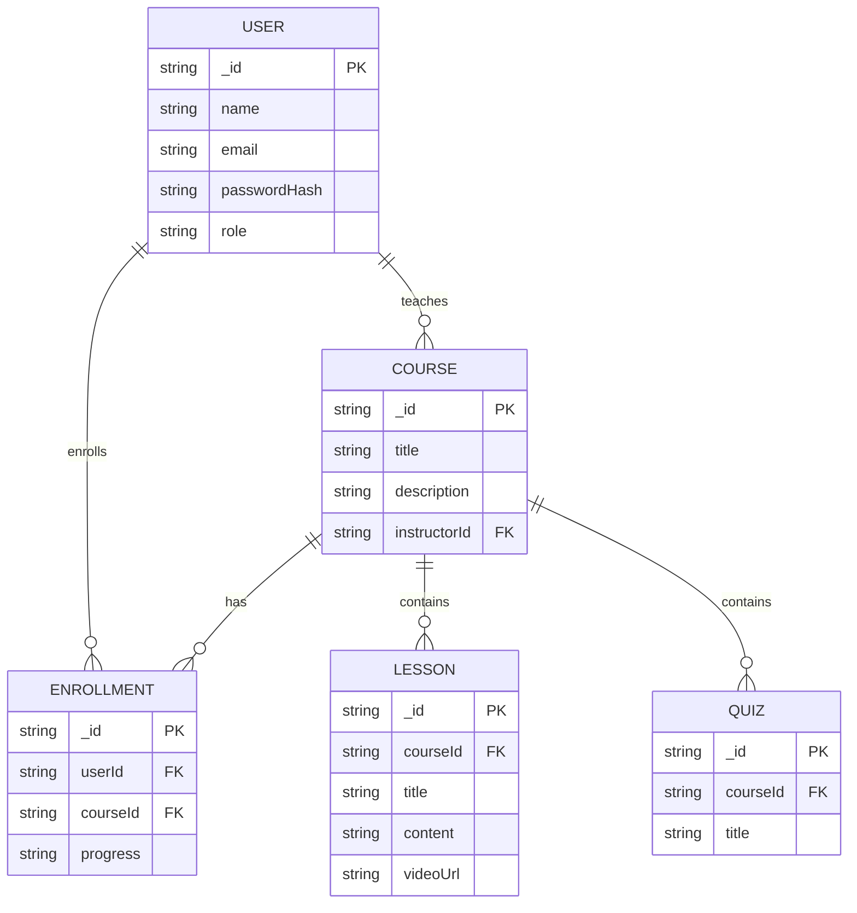
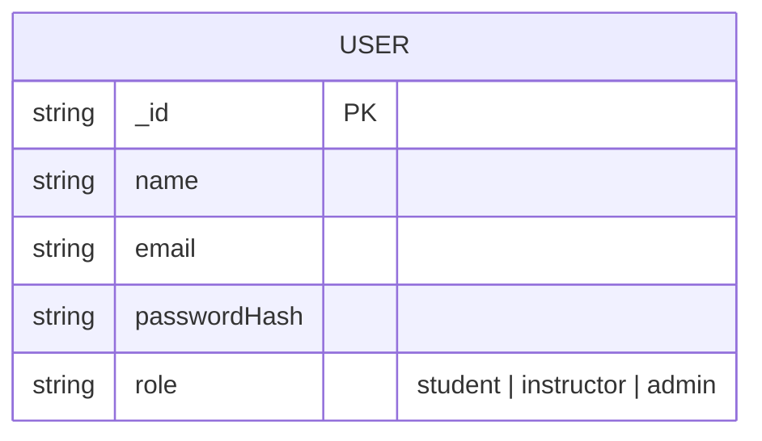

# 📘 E-Learning Platform (Project Practicum)

A full-stack boilerplate for building an **E-Learning Platform** with:

* **Frontend:** Vue 3 + Vite + Tailwind CSS + Pinia + Vue Router
* **Backend:** Node.js + Express + JWT Authentication + MongoDB
* **API Example:** User Auth (register/login) and Course CRUD

This repo gives you a **starter structure** to build courses, lessons, quizzes, payments, and more.

---

## 🚀 Features

### Frontend

* Vue 3 + Vite setup
* Tailwind CSS pre-configured
* Pinia store (state management)
* Vue Router (routing system)
* Axios API client
* Example auth store (`login/logout`)
* Example pages (`Home`, `Login`, `Courses`)

### Backend

* Express server with modular structure
* MongoDB (Mongoose models)
* JWT authentication (register/login)
* REST API routes (`/api/auth`, `/api/courses`)
* Example models: `User`, `Course`

---

## 📂 Folder Structure

```
e-learning-platform/
│── frontend/         # Vue 3 + Vite app
│   ├── src/          # Vue source code
│   ├── public/
│   ├── package.json
│   └── node_modules/
│
│── backend/          # Express API
│   ├── src/          # API source code
│   ├── .env          # Environment variables
│   ├── package.json
│   └── node_modules/
│
│── README.md
│── .gitignore
```

---

## ⚙️ Setup Instructions

### 1. Clone Repository

```bash
git clone https://github.com/Rathanak-Phan/e-learning-platform-pp.git
cd e-learning-platform
```

### 2. Frontend Setup (Vue 3 + Vite)

```bash
cd frontend
npm install
npm run dev
```

Frontend runs at 👉 `http://localhost:5173`

### 3. Backend Setup (Express API)

```bash
cd ../backend
npm install
```

Create a `.env` file inside `backend/`:

```env
PORT=5000
MONGO_URI=mongodb://localhost:27017/elearning
JWT_SECRET=supersecretkey
```

Run backend:

```bash
npm run dev
```

Backend runs at 👉 `http://localhost:5000`

---

## 🔗 Connecting Frontend & Backend

* Frontend Axios config (`frontend/src/services/api.js`):

```js
import axios from "axios";

const api = axios.create({
  baseURL: "http://localhost:5000/api",
});

export default api;
```

* Example API request:

```js
import api from "./api";

export const fetchCourses = () => api.get("/courses");
```

---

## 🏗️ System Architecture




💡 Tip: If you want to show the `role` ENUM in the ER diagram, you can add it as a comment or note:



---

## 🧑‍💻 Scripts

From project root:

* Start frontend only:

  ```bash
  cd frontend && npm run dev
  ```

* Start backend only:

  ```bash
  cd backend && npm run dev
  ```

* (Optional) Run both together (add to root `package.json`):

  ```json
  {
    "scripts": {
      "dev": "concurrently \"npm run dev --prefix frontend\" \"npm run dev --prefix backend\""
    }
  }
  ```

Then:

```bash
npm run dev
```

---

## 🛠 Future Improvements

* [ ] Add Lesson model & API
* [ ] Add Quiz & Submission system
* [ ] Add Payments (Stripe/PayPal)
* [ ] Add File/Video Upload (S3, Cloudinary, etc.)
* [ ] Deploy to Vercel (frontend) + Render/Railway (backend)

---

## 📜 License

This project is open-source under the MIT License.
